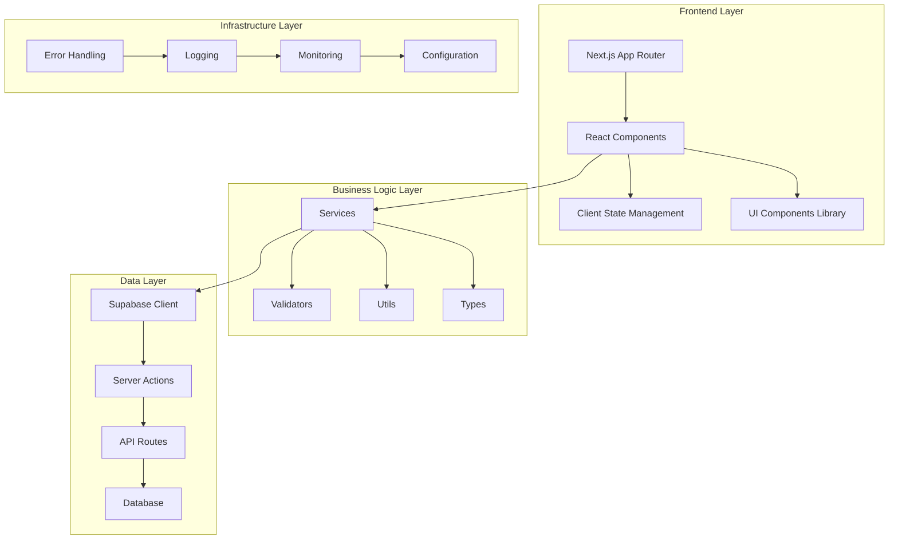

# Document de Conception - Amélioration Clean Code E-commerce Miel

## Vue d'ensemble

Cette conception détaille l'architecture et les améliorations nécessaires pour
transformer le site e-commerce "مناحل الرحيق" en une application robuste,
maintenable et performante. L'approche se base sur les principes du clean code,
les bonnes pratiques React/Next.js, et les standards de l'industrie e-commerce.

## Architecture

### Architecture Globale



### Structure des Dossiers Améliorée

```
src/
├── app/                    # Next.js App Router
├── components/             # Composants React
│   ├── ui/                # Composants UI de base
│   ├── forms/             # Composants de formulaires
│   ├── layout/            # Composants de mise en page
│   └── business/          # Composants métier spécifiques
├── lib/                   # Utilitaires et configurations
│   ├── supabase/          # Configuration Supabase
│   ├── validation/        # Schémas de validation
│   ├── utils/             # Fonctions utilitaires
│   └── constants/         # Constantes de l'application
├── services/              # Services métier
│   ├── auth/              # Services d'authentification
│   ├── cart/              # Services de panier
│   ├── products/          # Services de produits
│   └── orders/            # Services de commandes
├── types/                 # Types TypeScript
│   ├── api/               # Types d'API
│   ├── database/          # Types de base de données
│   └── business/          # Types métier
├── hooks/                 # Hooks React personnalisés
├── context/               # Contextes React
├── middleware/            # Middleware Next.js
└── locales/               # Fichiers de traduction
```

## Composants et Interfaces

### 1. Système de Gestion d'Erreurs

#### Interface ErrorHandler

```typescript
interface ErrorHandler {
  logError(error: Error, context?: ErrorContext): void;
  handleClientError(error: Error): UserFriendlyError;
  handleServerError(error: Error): APIErrorResponse;
}

interface ErrorContext {
  userId?: string;
  action: string;
  component?: string;
  metadata?: Record<string, any>;
}

interface UserFriendlyError {
  message: string;
  code: string;
  severity: 'info' | 'warning' | 'error';
}
```

#### Logger Service

```typescript
interface Logger {
  info(message: string, meta?: LogMetadata): void;
  warn(message: string, meta?: LogMetadata): void;
  error(message: string, error?: Error, meta?: LogMetadata): void;
  debug(message: string, meta?: LogMetadata): void;
}

interface LogMetadata {
  userId?: string;
  sessionId?: string;
  action: string;
  timestamp: Date;
  [key: string]: any;
}
```

### 2. Système de Validation

#### Validation Schema

```typescript
interface ValidationSchema<T> {
  validate(data: unknown): ValidationResult<T>;
  validateField(field: keyof T, value: unknown): FieldValidationResult;
}

interface ValidationResult<T> {
  success: boolean;
  data?: T;
  errors?: ValidationError[];
}

interface ValidationError {
  field: string;
  message: string;
  code: string;
}
```

#### Validators Spécifiques

- ProductValidator: Validation des données produit
- UserValidator: Validation des données utilisateur
- OrderValidator: Validation des commandes
- AddressValidator: Validation des adresses

### 3. Services Métier

#### ProductService

```typescript
interface ProductService {
  getProducts(filters?: ProductFilters): Promise<ServiceResult<Product[]>>;
  getProduct(id: string): Promise<ServiceResult<Product>>;
  searchProducts(query: string): Promise<ServiceResult<Product[]>>;
  getProductsByCategory(categoryId: string): Promise<ServiceResult<Product[]>>;
}
```

#### CartService

```typescript
interface CartService {
  addItem(productId: string, quantity: number): Promise<ServiceResult<void>>;
  removeItem(itemId: string): Promise<ServiceResult<void>>;
  updateQuantity(
    itemId: string,
    quantity: number
  ): Promise<ServiceResult<void>>;
  getCart(): Promise<ServiceResult<Cart>>;
  clearCart(): Promise<ServiceResult<void>>;
}
```

#### OrderService

```typescript
interface OrderService {
  createOrder(orderData: CreateOrderData): Promise<ServiceResult<Order>>;
  getOrders(userId: string): Promise<ServiceResult<Order[]>>;
  getOrder(orderId: string): Promise<ServiceResult<Order>>;
  updateOrderStatus(
    orderId: string,
    status: OrderStatus
  ): Promise<ServiceResult<void>>;
}
```

### 4. Système d'Internationalisation

#### Translation Service

```typescript
interface TranslationService {
  t(key: string, params?: Record<string, string>): string;
  formatCurrency(amount: number, currency?: string): string;
  formatDate(date: Date, format?: string): string;
  formatNumber(number: number): string;
}
```

#### Structure des Traductions

```typescript
interface Translations {
  common: {
    loading: string;
    error: string;
    success: string;
    cancel: string;
    confirm: string;
  };
  navigation: {
    home: string;
    products: string;
    cart: string;
    profile: string;
  };
  products: {
    title: string;
    description: string;
    price: string;
    addToCart: string;
  };
  // ... autres sections
}
```

## Modèles de Données

### Types Métier Améliorés

```typescript
// Types de base
interface BaseEntity {
  id: string;
  createdAt: Date;
  updatedAt: Date;
}

// Produit
interface Product extends BaseEntity {
  name: string;
  description: string | null;
  price: number;
  stock: number;
  imageUrl: string | null;
  category: Category;
  isActive: boolean;
  metadata?: ProductMetadata;
}

interface ProductMetadata {
  origin?: string;
  harvestDate?: Date;
  certifications?: string[];
  nutritionalInfo?: NutritionalInfo;
}

// Utilisateur
interface User extends BaseEntity {
  email: string;
  firstName: string;
  lastName: string;
  role: UserRole;
  profile?: UserProfile;
}

interface UserProfile {
  phoneNumber?: string;
  dateOfBirth?: Date;
  preferences?: UserPreferences;
  address?: Address;
}

// Commande
interface Order extends BaseEntity {
  customerId: string;
  items: OrderItem[];
  totalAmount: number;
  status: OrderStatus;
  shippingAddress: Address;
  paymentMethod: PaymentMethod;
  notes?: string;
}

// Panier
interface Cart extends BaseEntity {
  customerId: string;
  items: CartItem[];
  totalAmount: number;
  expiresAt: Date;
}
```

### Enums et Constantes

```typescript
enum OrderStatus {
  PENDING = 'pending',
  CONFIRMED = 'confirmed',
  PROCESSING = 'processing',
  SHIPPED = 'shipped',
  DELIVERED = 'delivered',
  CANCELLED = 'cancelled',
}

enum UserRole {
  CUSTOMER = 'customer',
  ADMIN = 'admin',
  MODERATOR = 'moderator',
}

enum PaymentMethod {
  CASH_ON_DELIVERY = 'cash_on_delivery',
  CREDIT_CARD = 'credit_card',
  BANK_TRANSFER = 'bank_transfer',
}
```

## Gestion des Erreurs

### Stratégie de Gestion d'Erreurs

1. **Erreurs Client**: Affichage de messages utilisateur localisés
2. **Erreurs Serveur**: Logging détaillé + réponse générique
3. **Erreurs de Validation**: Messages spécifiques par champ
4. **Erreurs Réseau**: Retry automatique + fallback

### Classes d'Erreurs Personnalisées

```typescript
class BusinessError extends Error {
  constructor(
    message: string,
    public code: string,
    public severity: 'low' | 'medium' | 'high' = 'medium'
  ) {
    super(message);
    this.name = 'BusinessError';
  }
}

class ValidationError extends Error {
  constructor(
    message: string,
    public field: string,
    public code: string
  ) {
    super(message);
    this.name = 'ValidationError';
  }
}

class NetworkError extends Error {
  constructor(
    message: string,
    public statusCode: number,
    public retryable: boolean = true
  ) {
    super(message);
    this.name = 'NetworkError';
  }
}
```

## Stratégie de Test

### Types de Tests

1. **Tests Unitaires**: Services, utilitaires, hooks
2. **Tests d'Intégration**: API routes, actions serveur
3. **Tests de Composants**: Rendu, interactions utilisateur
4. **Tests E2E**: Parcours utilisateur critiques

### Structure des Tests

```
__tests__/
├── unit/
│   ├── services/
│   ├── utils/
│   └── hooks/
├── integration/
│   ├── api/
│   └── actions/
├── components/
│   ├── ui/
│   └── business/
└── e2e/
    ├── auth.spec.ts
    ├── cart.spec.ts
    └── checkout.spec.ts
```

### Outils de Test

- **Jest**: Tests unitaires et d'intégration
- **React Testing Library**: Tests de composants
- **Playwright**: Tests E2E
- **MSW**: Mock des APIs pour les tests

## Performance et Optimisation

### Stratégies d'Optimisation

1. **Images**: Next.js Image avec optimisation automatique
2. **Code Splitting**: Lazy loading des composants
3. **Caching**: Redis pour les données fréquemment accédées
4. **CDN**: Cloudflare pour les assets statiques
5. **Database**: Index optimisés, requêtes efficaces

### Métriques de Performance

- **Core Web Vitals**: LCP, FID, CLS
- **Time to Interactive**: < 3 secondes
- **Bundle Size**: < 250KB initial
- **API Response Time**: < 500ms moyenne

## Sécurité

### Mesures de Sécurité

1. **Authentification**: JWT avec refresh tokens
2. **Autorisation**: RBAC (Role-Based Access Control)
3. **Validation**: Côté client et serveur
4. **Sanitization**: XSS protection
5. **HTTPS**: Obligatoire en production
6. **Rate Limiting**: Protection contre les abus

### Configuration Sécurisée

```typescript
interface SecurityConfig {
  jwt: {
    secret: string;
    expiresIn: string;
    refreshExpiresIn: string;
  };
  rateLimit: {
    windowMs: number;
    max: number;
  };
  cors: {
    origin: string[];
    credentials: boolean;
  };
}
```

## Monitoring et Observabilité

### Métriques à Surveiller

1. **Performance**: Temps de réponse, throughput
2. **Erreurs**: Taux d'erreur, types d'erreurs
3. **Business**: Conversions, panier abandonné
4. **Infrastructure**: CPU, mémoire, base de données

### Outils de Monitoring

- **Vercel Analytics**: Performance frontend
- **Sentry**: Error tracking
- **Supabase Metrics**: Database monitoring
- **Custom Dashboard**: Métriques business

## Configuration et Environnements

### Gestion de la Configuration

```typescript
interface AppConfig {
  app: {
    name: string;
    version: string;
    environment: 'development' | 'staging' | 'production';
  };
  database: {
    url: string;
    maxConnections: number;
  };
  auth: {
    jwtSecret: string;
    sessionTimeout: number;
  };
  external: {
    supabaseUrl: string;
    supabaseAnonKey: string;
    uploadthingToken: string;
  };
  features: {
    enableChatbot: boolean;
    enableAnalytics: boolean;
    enableA11y: boolean;
  };
}
```

### Validation de Configuration

- Validation au démarrage de l'application
- Types TypeScript pour toutes les configurations
- Variables d'environnement obligatoires documentées
- Valeurs par défaut sécurisées

## Accessibilité

### Standards d'Accessibilité

1. **WCAG 2.1 AA**: Conformité complète
2. **Semantic HTML**: Structure appropriée
3. **ARIA Labels**: Navigation assistée
4. **Keyboard Navigation**: Support complet
5. **Screen Readers**: Compatibilité testée

### Composants Accessibles

- Tous les composants UI avec support ARIA
- Focus management approprié
- Contrastes de couleur validés
- Textes alternatifs pour les images
- Messages d'erreur annoncés

## Migration et Déploiement

### Plan de Migration

1. **Phase 1**: Infrastructure et configuration
2. **Phase 2**: Services et validation
3. **Phase 3**: Composants et UI
4. **Phase 4**: Tests et monitoring
5. **Phase 5**: Déploiement et validation

### Stratégie de Déploiement

- **Blue-Green Deployment**: Zéro downtime
- **Feature Flags**: Déploiement progressif
- **Rollback Plan**: Retour rapide en cas de problème
- **Health Checks**: Validation automatique post-déploiement
