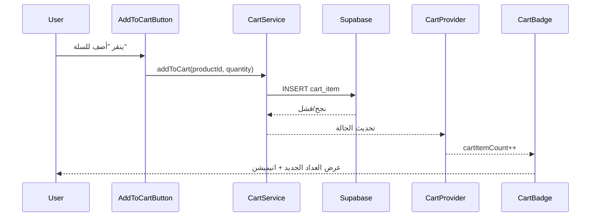

# 🛒 نظام السلة المحسن - HoneyStore

## ✨ الميزات الجديدة

### 🎯 المؤشر الرقمي على أيقونة السلة

- **عداد المنتجات** - يظهر عدد المنتجات في السلة
- **تحديث فوري** - يتحدث العداد فور إضافة/حذف منتج
- **تأثيرات بصرية** - انيميشن عند تغيير العدد
- **تصميم متجاوب** - يعمل على جميع الأحجام

### 🔧 المكونات الجديدة

#### 1. **CartProvider** - مزود السياق

```tsx
// في layout.tsx
<SessionProvider>
  <CartProvider>
    <App />
  </CartProvider>
</SessionProvider>
```

#### 2. **useCart Hook** - خطاف السلة

```tsx
import { useCart } from '@/context/CartProvider';

function MyComponent() {
  const {
    cart, // بيانات السلة
    cartItemCount, // عدد المنتجات
    loading, // حالة التحميل
    error, // رسائل الخطأ
    addToCart, // إضافة منتج
    updateCartItem, // تحديث كمية
    removeFromCart, // حذف منتج
    clearCart, // إفراغ السلة
    refreshCart, // تحديث السلة
  } = useCart();
}
```

#### 3. **CartBadge** - شارة السلة

```tsx
import { CartBadge } from '@/components/ui/cart-badge';

// استخدام بسيط
<CartBadge />

// مع نص
<CartBadge showText={true} />

// مع تخصيص
<CartBadge className="custom-style" />
```

#### 4. **AddToCartButton** - زر الإضافة

```tsx
import { AddToCartButton } from '@/components/ui/add-to-cart-button';

// زر بسيط
<AddToCartButton
  productId="product-123"
  productName="عسل الزهور"
/>

// مع أدوات التحكم في الكمية
<AddToCartButton
  productId="product-123"
  productName="عسل الزهور"
  showQuantityControls={true}
  variant="outline"
  size="lg"
/>
```

## 🎨 التأثيرات البصرية

### 1. **انيميشن العداد**

- تكبير عند إضافة منتج
- تأثير النبض للمنتجات الجديدة
- تغيير اللون عند التحديث
- انتقال سلس بين الأرقام

### 2. **حالات العرض**

```tsx
// عداد عادي (1-99)
<span className="bg-red-500 text-white rounded-full">
  {count}
</span>

// عداد كبير (+99)
<span className="bg-red-500 text-white rounded-full text-xs">
  99+
</span>

// حالة فارغة
// لا يظهر العداد
```

## 🔄 تدفق العمل

### 1. **إضافة منتج للسلة**



### 2. **تحديث العداد**

```typescript
// في CartProvider
useEffect(() => {
  if (session?.user?.id && !sessionLoading) {
    loadCart(); // تحميل السلة
  }
}, [session?.user?.id, sessionLoading]);

// حساب العدد
const cartItemCount = cart?.totalItems || 0;
```

## 📱 التصميم المتجاوب

### الشاشات الصغيرة (موبايل)

```tsx
<div className='flex items-center'>
  <CartBadge className='p-1' /> {/* حجم صغير */}
</div>
```

### الشاشات المتوسطة (تابلت)

```tsx
<div className='flex items-center gap-2'>
  <CartBadge showText={true} /> {/* مع نص */}
</div>
```

### الشاشات الكبيرة (ديسكتوب)

```tsx
<div className='flex items-center gap-4'>
  <CartDropdown /> {/* قائمة منسدلة */}
</div>
```

## 🔔 الإشعارات

### 1. **إشعارات النجاح**

```typescript
// عند إضافة منتج
toast.success('تم إضافة المنتج إلى السلة', {
  description: `تم إضافة ${quantity} من ${productName} إلى سلة التسوق`,
});
```

### 2. **إشعارات الخطأ**

```typescript
// عند فشل الإضافة
toast.error('فشل في إضافة المنتج', {
  description: 'حدث خطأ أثناء إضافة المنتج إلى السلة',
});
```

## 🎯 أمثلة الاستخدام

### 1. **في صفحة المنتجات**

```tsx
function ProductCard({ product }) {
  return (
    <Card>
      <CardContent>
        <h3>{product.name}</h3>
        <p>{product.price} د.ت</p>

        <AddToCartButton
          productId={product.id}
          productName={product.name}
          showQuantityControls={true}
          className='w-full mt-4'
        />
      </CardContent>
    </Card>
  );
}
```

### 2. **في الهيدر**

```tsx
function SiteHeader() {
  return (
    <header>
      <nav className='flex items-center justify-between'>
        <Logo />

        <div className='flex items-center gap-4'>
          <CartBadge /> {/* العداد مع الرابط */}
          <UserMenu />
        </div>
      </nav>
    </header>
  );
}
```

## 🚀 الأداء

### 1. **التحسينات المطبقة**

- **Debouncing** - تجميع الطلبات المتتالية
- **Caching** - تخزين مؤقت للسلة
- **Lazy Loading** - تحميل البيانات عند الحاجة
- **Optimistic Updates** - تحديث فوري للواجهة

## 🔍 استكشاف الأخطاء

### مشاكل شائعة

1. **العداد لا يتحدث**
   - تأكد من وجود CartProvider في layout
   - تحقق من صحة session المستخدم

2. **الانيميشن لا يعمل**
   - تأكد من وجود Tailwind CSS
   - تحقق من الـ transitions في CSS

3. **الإشعارات لا تظهر**
   - تأكد من وجود Toaster في layout
   - تحقق من إعدادات sonner

### حلول سريعة

```bash
# إعادة تشغيل التطوير
npm run dev

# تنظيف cache
rm -rf .next
npm run dev

# تحقق من console للأخطاء
# F12 > Console
```

---

**نظام السلة محسن ومجهز! 🛒✨**
